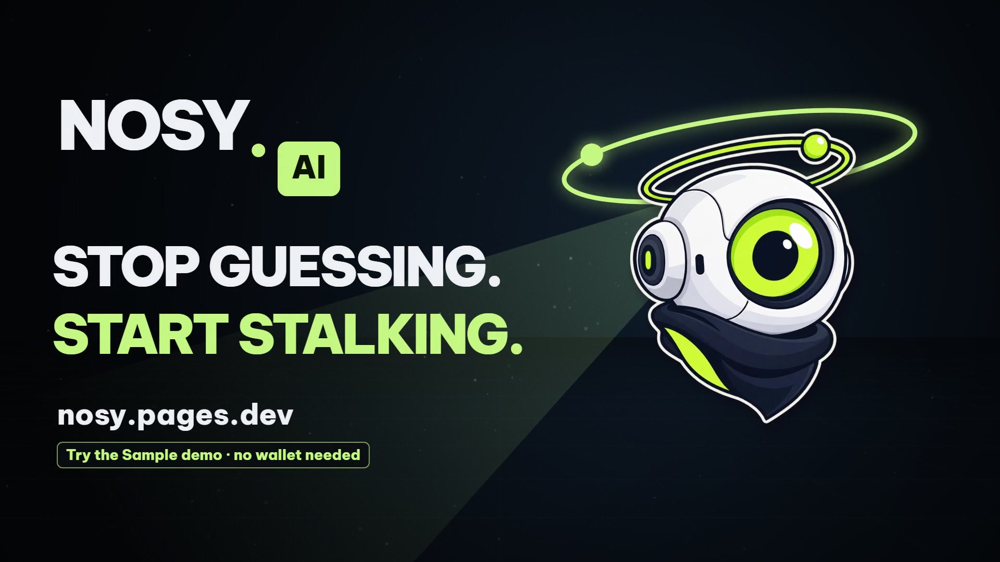
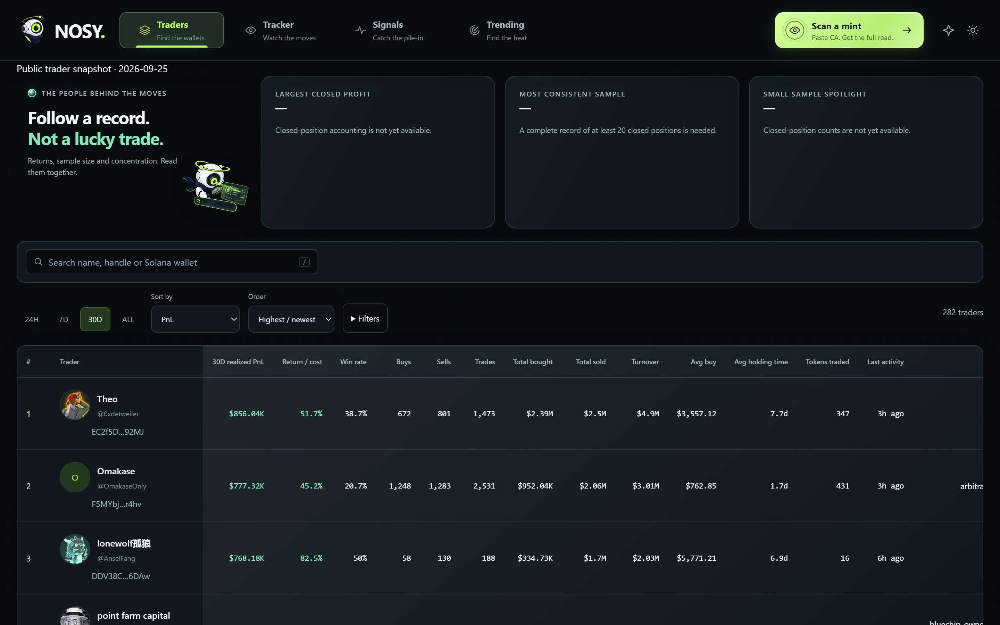
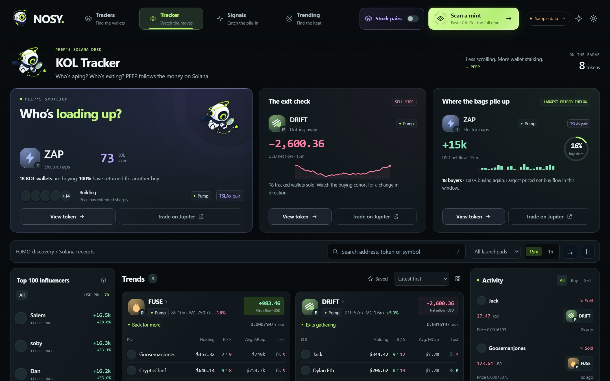
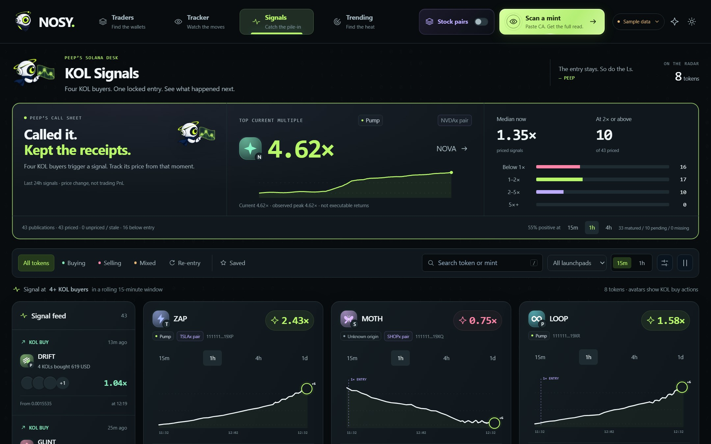
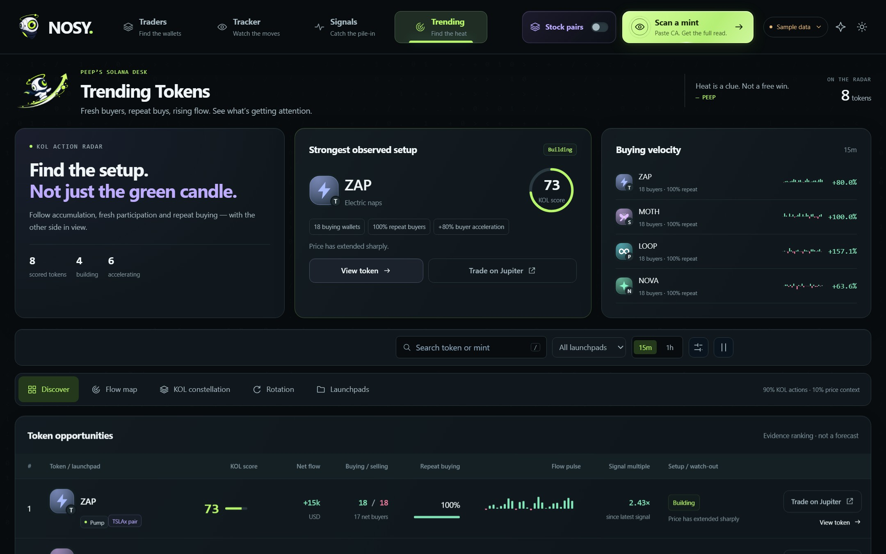
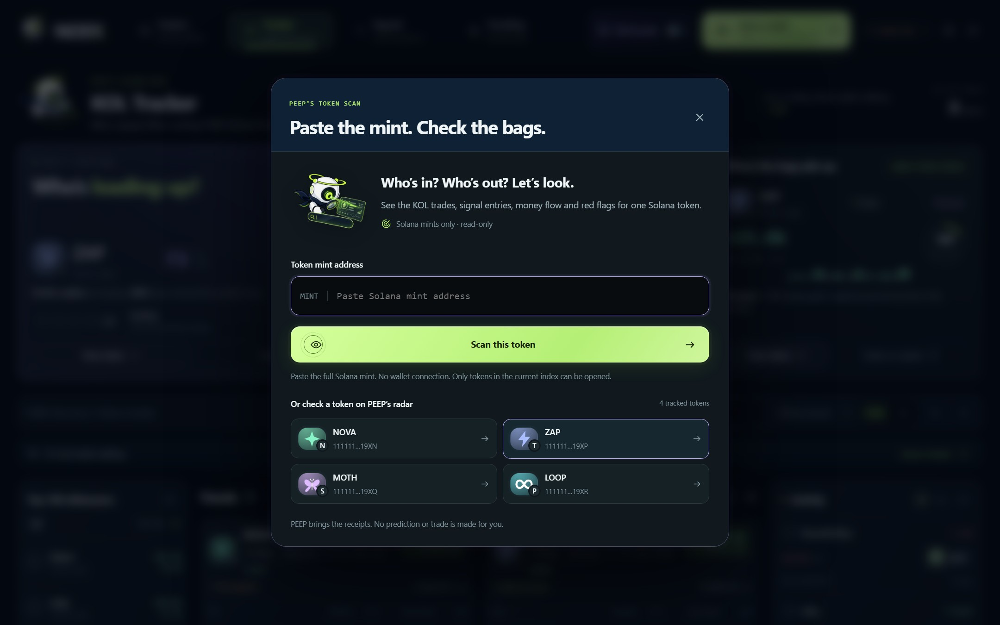
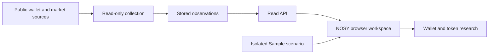

<p align="center">
  
</p>

<h1 align="center">NOSY AI · Stocklana</h1>
<p align="center"><strong>Follow the wallets. Read the evidence.</strong></p>
<p align="center">A read-only Solana research workspace that brings public trader profiles, wallet activity and token context into one connected view.</p>
<p align="center">
  <a href="https://nosy.pages.dev/">Open NOSY</a> ·
  <a href="https://nosy.pages.dev/showcase/">Try the Sample demo</a> ·
  <a href="docs/JUDGES-GUIDE.md">Judge's walkthrough</a> ·
  <a href="submission/project-info.md">Project info</a>
</p>

## Why NOSY exists

A profitable screenshot tells you very little about the wallet behind it. Solana's public activity contains much more context, but following that context across explorers, wallet profiles and token dashboards takes work.

NOSY connects those views. Start with a trader, inspect their observed activity, see which tokens attract multiple tracked wallets, then open a token report. PEEP, the one-eyed mascot, gives the workspace its curious personality.

**For Stocklana judges:** this repository contains a curated product overview, original product assets, captured screens and two selected source modules with runnable tests. It is **not a full application checkout**. Core analytics, provider integrations, collection workers and deployment configuration remain private. See [what is included](docs/PUBLIC-SCOPE.md).

## Explore the product

| Surface | What to try | Current scope |
| --- | --- | --- |
| **Traders** | Search public profiles, compare available periods, open wallet details. | Public identities and provider-reported metrics; some fields and histories are incomplete. |
| **Tracker** | Inspect buys, sells and token-level participation. | Collected observations; collection coverage and price availability vary. |
| **Signals** | Explore groups of tracked buyers and inspect the Sample scenario's entry/outcome workflow. | Live observed groups are distinct from fully qualified signals. Locked entries and subsequent outcomes are demonstrated in simulation. |
| **Trending** | Explore token attention, flow and participation through several views. | Rankings depend on available evidence; incomplete inputs can leave scores unavailable. |
| **Token research** | Open a supported token and inspect its report chapters. | Coverage is limited to available/indexed data. Unavailable tokens may not resolve. |
| **Stock-pair lens** | Inspect the sample's tokenized-stock pairing concept. | Demonstrated with fictional pairs. A verified live stock-pair registry is planned. |

### A quick path through NOSY

1. Open the [Sample demo](https://nosy.pages.dev/showcase/). No wallet connection is required.
2. Explore **Traders**, switch a period and open a wallet.
3. Use **Next step** to advance the authored scenario, then explore **Tracker**, **Signals** and **Trending**.
4. Open **Scan a mint** and choose a token already present in the sample. Inspect the report and its available evidence.
5. Compare the sample with the [live workspace](https://nosy.pages.dev/). Live coverage may be partial or delayed; an empty state is meaningful.

The Sample uses a captured public trader dataset dated **25 September 2026** alongside **simulated market activity**. Its trades, signal multiples, prices and stock-pair examples are not live results or investment returns. The interface labels the sample explicitly.

## Inside the workspace

**Traders — captured public-profile snapshot, 25 September 2026.** Figures are dated provider-reported values, not current account balances or independently verified profits.



<table>
  <tr>
    <td width="50%"><strong>Tracker · simulated activity</strong><br></td>
    <td width="50%"><strong>Signals · simulated outcomes</strong><br></td>
  </tr>
  <tr>
    <td><strong>Trending · simulated market</strong><br></td>
    <td><strong>Token scan · sample interface</strong><br></td>
  </tr>
</table>

These are existing application captures, not freshly measured live results. [Asset context and attribution](assets/README.md) accompany every image family.

## How it works



The application uses **JavaScript and Node.js**, a vanilla DOM interface, a read API and background collection. The browser is hosted on **Cloudflare Pages**; the backend uses Node and SQLite where needed. Helius supplies Solana observations; FOMO and GMGN supply public profile or reported wallet information; market sources provide quote context. These are integrations, not endorsements.

The sample runs an authored scenario separately from live data. The application is read-only: no custody, signing or submitted trades. Jupiter actions are external handoffs where applicable; fictional sample actions do not execute trades.

“NOSY AI” is the product name and character. The demonstrated analytics are deterministic; this submission does not claim a trained prediction model, an LLM trading agent or autonomous execution.

See [the architecture overview](docs/ARCHITECTURE.md) for the public system boundary and [data limitations](docs/DATA-AND-LIMITATIONS.md) for the distinction between observation, simulation and qualified financial accounting.

## Inspect the selected source

The two modules below are copied from the existing application. They expose generic input and presentation behavior without the private research engines.

| File | Purpose | Boundary |
| --- | --- | --- |
| [`src/identity.cjs`](src/identity.cjs) | Normalize address/signature input and check Base58 character/length syntax. | Does not decode keys or prove an account exists on-chain. |
| [`src/format.cjs`](src/format.cjs) | Escape display text and format money, percentages and time. | Display utility, not a valuation or accounting engine. Compact money output has ordinary JavaScript number limits. |

Use **Node.js 22.16 or newer**. There are no package dependencies to install.

```sh
git clone https://github.com/animeme99/NOSY-Stocklana.git
cd NOSY-Stocklana
npm test
npm run verify
```

`npm test` exercises only the selected utilities. `npm run verify` checks the public file inventory, local document links, image signatures, recorded hashes and Project Info length limits. Neither command builds the full application or certifies live financial data.

## What is next

- Broader historical coverage and complete closed-position accounting.
- Fully priced, qualified mainnet signal history with traceable outcomes.
- A verified live tokenized-stock pair registry.
- More resilient handling of incomplete or delayed provider data.

NOSY existed before this submission as earlier NOSY/PEEP iterations. This entry presents continued work on an existing product; it does not claim that the entire codebase was created during the event. The repository's initial public commit is a curated export, not the original development history.

## Repository map

```text
assets/       Cover, five product captures and four PEEP brand assets
docs/         Judge's guide, architecture, data limits and public scope
src/          Two selected application utilities
tests/        Focused tests for those utilities
scripts/      Public-kit integrity check
submission/   Copy-ready Project Info in Markdown and JSON
```

**Start with the product:** [nosy.pages.dev](https://nosy.pages.dev/) · **Use the authored walkthrough:** [Sample demo](https://nosy.pages.dev/showcase/)
